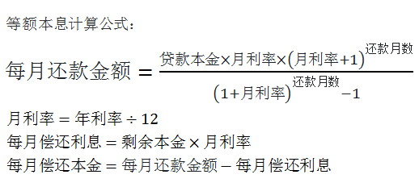

等额本息还款法，是指借款人每月按相等的金额偿还贷款本息，其中每月贷款利息按月初剩余贷款本金计算并逐月结清。

推导过程为：

设贷款总额为 A，银行月利率为 R，总期数为 n（个月），月还款额设为 X，则各个月所欠银行贷款为：

第一个月 `A(1+R)-X`
第二个月 `(A(1+R)-X)(1+R)-X = A(1+R)^2-X[1+(1+R)]`
第三个月 `[A(1+R)-X)(1+R)-X](1+R)-X = A(1+R)^3-X[1+(1+R)+(1+R)^2] `
…
由此可得第 n 个月后所欠银行贷款为 
`A(1+R)^n–X[1+(1+R)+(1+R)^2+…+(1+R)^(n-1)] = A(1+R)^n –X[(1+R)^n - 1]/R`

由于还款总期数为 n，也即第 n 月刚好还完银行所有贷款，

因此有 A(1+R)^n – X[(1+R)^n - 1]/R = 0

由此求得 X = AR(1+R)^n /[(1+R)^n - 1]

